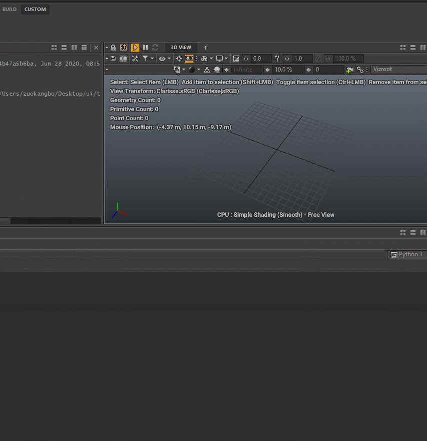

<!--
 * @Author: zuokangbo
 * @Date: 2021-05-16 14:33:14
-->
pyblish-clarisse
==============
Pyblish for clarisse


Usage
----------------

```python
from pyblish_clarisse import app
app.setup()
```

<br>
<br>
<br>

For example:


Quick demo in clarisse
--------------------
